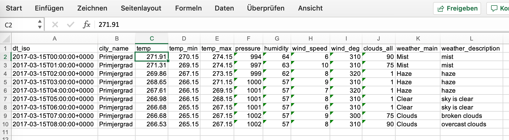
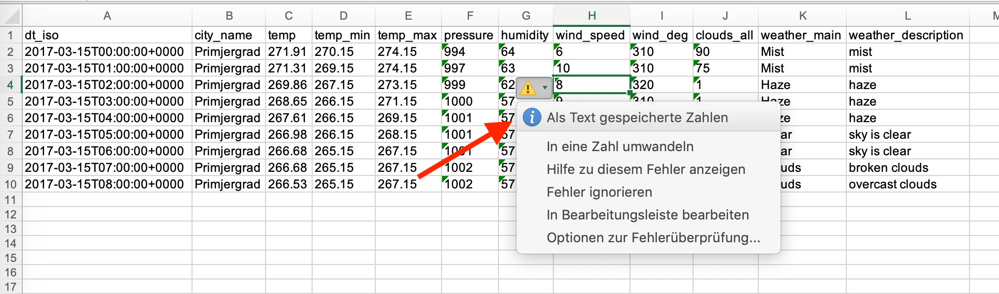
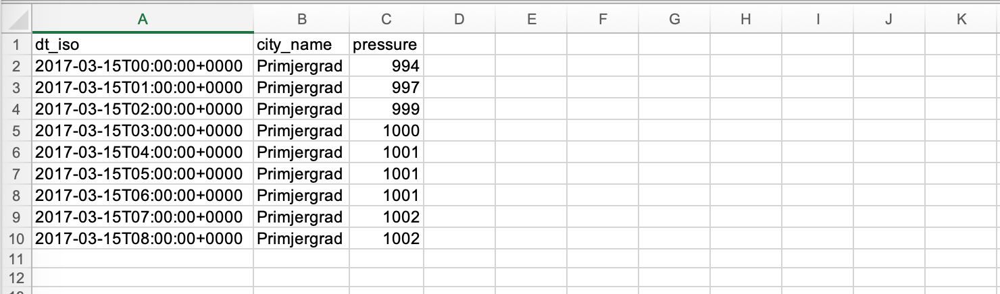
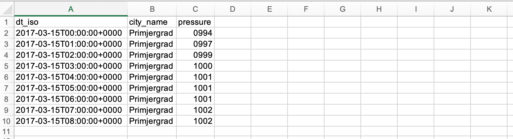
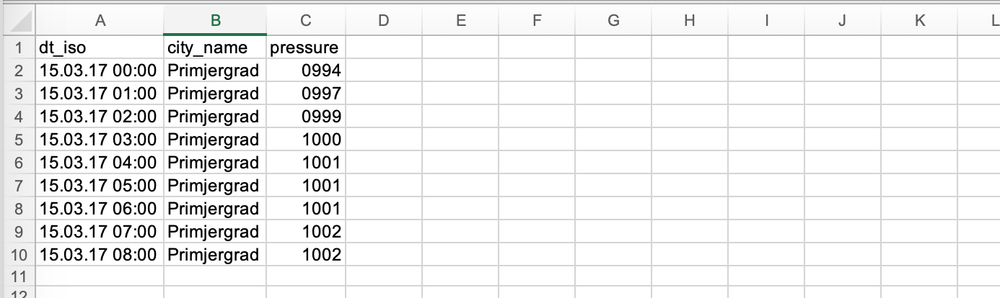

# csv2xlsx tutorial

### The sample file

Let’s do a little walk-thru (I will use this for the documentation also). Let’s say we have this CSV file with 12 columns:

	dt_iso;city_name;temp;temp_min;temp_max;pressure;humidity;wind_speed;wind_deg;clouds_all;weather_main;weather_description
	2017-03-15T00:00:00+0000;Primjergrad;271.91;270.15;274.15;994;64;6;310;90;Mist;mist
	2017-03-15T01:00:00+0000;Primjergrad;271.31;269.15;274.15;997;63;10;310;75;Mist;mist
	2017-03-15T02:00:00+0000;Primjergrad;269.86;267.15;273.15;999;62;8;320;1;Haze;haze
	2017-03-15T03:00:00+0000;Primjergrad;268.65;266.15;271.15;1000;57;9;310;1;Haze;haze
	2017-03-15T04:00:00+0000;Primjergrad;267.61;266.15;269.15;1001;57;7;320;1;Haze;haze
	2017-03-15T05:00:00+0000;Primjergrad;266.98;266.15;268.15;1001;57;8;310;1;Clear;sky is clear
	2017-03-15T06:00:00+0000;Primjergrad;266.68;265.15;267.15;1001;57;6;310;1;Clear;sky is clear
	2017-03-15T07:00:00+0000;Primjergrad;266.68;265.15;267.15;1002;57;9;300;75;Clouds;broken clouds
	2017-03-15T08:00:00+0000;Primjergrad;266.53;265.15;267.15;1002;57;8;310;90;Clouds;overcast clouds

Now we will transfer this into a usable Excel step by step. I use the Mac/Linux executable here, if you are in Windows, just replace it with csv2xlsx.exe.

### Just convert with defaults

The most simple command possible is this:

`./csv2xlsx -colsep ";" -infile weather.csv -outfile weather.xlsx -silent -overwrite`

We use -overwrite to overwrite an existing file, so I don’t have to remove it during these steps and -silent to not display all these progress messages. As we have a column separator that is different from the default of `"|"`, we have to specify this also.

After the conversion the output file `weather.xlsx` looks like this:

As you can see (if you started using `csv2xlsx` with earlier releases) the tool checks if a column value is numeric and automatically chooses the correct data type and displays the value right-aligned. Great news, because now for most cases there's no more work to do!

### Specify column ranges and data types

We have the column fields below in our file (the number is the index, _0-based position number_):

     0	dt_iso
     1	city_name
     2	temp
     3	temp_min
     4	temp_max
     5	pressure
     6	humidity
     7	wind_speed
     8	wind_deg
     9	clouds_all
    10	weather_main
    11	weather_description
       
We can set a specfific data type for each of these columns. This allows for special formats, numbers that really should be texts and more.
Let's assume that we want to have the old behavior of `csv2clsx` where everything you didn't specifiy was treated as text.

#### Everything should be text

We append the option `-column 0-11:text` at the end of the command to specify the column range from 0 to 11 as text (as you see, you may specify a continuous range of columns in the form of <FROM>-<TO>).

`./csv2xlsx -colsep ";" -silent -overwrite -infile weather.csv -outfile ./weather.xlsx -columns 0-11:text`

The result shows that everything is left-aligned and stored as text cells (the cell tipp message in German states "_Numbers stored as text_").

#### Ignoring columns

If you do not need every column in the input file, using the `-columns` option is also a great way of ignoring certain data columns. 
Only columns that have been specified in th option will be processed. For the sake of an example, let's pretent we only need the date
of the observation, the city and the barometric pressure (_columns 0, 1 and 5_)

`./csv2xlsx  -overwrite -infile weather.csv -outfile ./weather.xlsx -colsep ";" -columns 0-1:text,5:integer`

The output file now contains only three columns, just what we wanted.

#### Specifying a number format

There is even a data type that allows individual number formats: `format` (_yes, I know, very creative_ 😉).
Barometric pressure should always be a four-digit number, so we specify the `format` data type and a format mask separated by an equal sign:

`./csv2xlsx  -overwrite -infile weather.csv -outfile ./weather.xlsx -colsep ";" -columns 0-1:text,5:format=0000`

#### Date formats

The first column contains a date that until now has been treated as text. Now we will convert this field into a valid Excel date cell.
We need to use the data type `date` and the option `-dateformat` to do this. Here's the online help for this option:

	-dateformat string
	    	format for CSV date cells (default YYYY-MM-DD) (default "2006-01-02")

As our data file contains date strings like `2017-03-15T02:00:00+0000` we have to specify the correct date mask: `"YYYY-MM-DDTHH:MI:SS+0000"`.
Now the command line looks like so:

`./csv2xlsx  -overwrite -infile weather.csv -outfile ./weather.xlsx -colsep ";" -dateformat "YYYY-MM-DDTHH:MI:SS+0000" -columns 0:date,1:text,5:format=0000`

And the result displays date cells in Excel, great!

**Important note**: I cannot stress enough that the combination of scientific data and date formats (or generally, working in Excel at all) is not to be treated lightly. About one in five scientific papers in the area of genetics most probably contains errors due to Excel trying to be "_helpful_" and automatically converting certain cell contents to a date value. For more information, refer to you favorite search engine or this link:
https://www.sciencemag.org/news/2016/08/one-five-genetics-papers-contains-errors-thanks-microsoft-excel

If you want to change the date format **within** Excel, use the option `-exceldateformat` and specify a date format

	-exceldateformat string
	   Excel format for date cells (default as in Excel)

#### Available data types

* text => well, text 
* number => int or float, depending on the data
* integer => integer values, will be checked
* currency => basically number, but uses the pre-defined format of `"#,##0.00;[red](#,##0.00)"`
* date => a parseable date string
* standard => whatever Excel thinks the data is
* percent => multiply value by 100 and append "%", precision two digits, (`"0.00%"`)
* formula => write the data as formula (allows for some cool things)
* format => basically number, but allows you to specify a format using `=FORMATSTRING`

### Appending data to existing files

    ./csv2xlsx --infile test2.csv --outfile /tmp/out.xlsx --append 
    
This will append data to the excel file after the last row of the first sheet.
You might want (if there is a header in the *input* data) not start from row 1, if you are appending data. 
Use the `--startrow` parameter to specify the starting row (*start row numbers re 1-based! Makes it easier for non-developers.*), like so:

    ./csv2xlsx --infile test2.csv --outfile /tmp/out.xlsx --append --startrow 2

### Using multiple worksheets

Using the `--sheet` parameter, you can specify the worksheet where the converted data will be written. 
Using a combination of the `--append` and `--sheet` parameters, you can create an Excel file with more than one worksheet.
The command below will append to the existing file, but write to a new sheet named *MyNewSheet*. 

    ./csv2xlsx --infile test2.csv --outfile /tmp/out.xlsx --append --startrow 2 --sheet MyNewSheet
